# FastAPI Multi-Agent System - Architectural Design Document

## Table of Contents

1. [Executive Summary](#executive-summary)
2. [System Architecture Overview](#system-architecture-overview)
3. [Component Architecture](#component-architecture)
4. [Service Boundaries and Communication](#service-boundaries-and-communication)
5. [Data Flow Architecture](#data-flow-architecture)
6. [API Layer Architecture](#api-layer-architecture)
7. [Database and Storage Architecture](#database-and-storage-architecture)
8. [Security Architecture](#security-architecture)
9. [Extensibility Design](#extensibility-design)
10. [Scalability Patterns](#scalability-patterns)
11. [Technical Architecture Patterns](#technical-architecture-patterns)
12. [Monitoring and Observability](#monitoring-and-observability)
13. [Error Handling and Resilience](#error-handling-and-resilience)
14. [Implementation Guidelines](#implementation-guidelines)

## Executive Summary

This document presents the architectural design for a scalable FastAPI-based multi-agent system designed for complex decision-making workflows. The architecture emphasizes modularity, testability, and extensibility while maintaining clear service boundaries and supporting horizontal scaling.

### Key Architectural Principles

- **Modular Design**: Components under 500 lines with clear separation of concerns
- **Event-Driven Architecture**: Asynchronous communication between agents
- **Plugin-Based Extensibility**: Dynamic agent registration and capability discovery
- **Configuration-Driven**: Environment-based configuration without hardcoded values
- **Test-Driven Development**: Comprehensive testing strategy with TDD anchors
- **Security-First**: Built-in authentication, authorization, and secure communication

## System Architecture Overview

### High-Level System Diagram

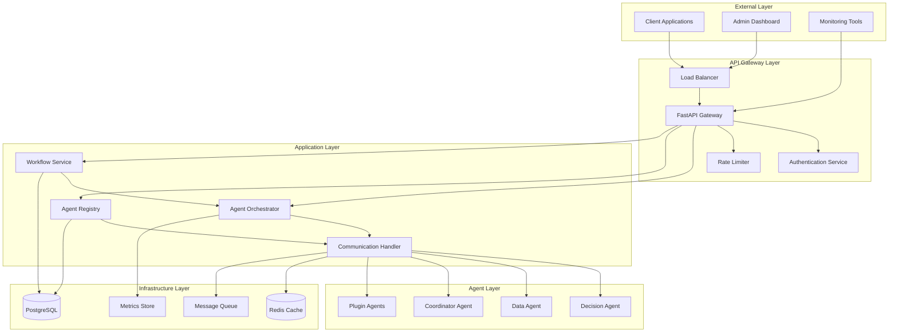

### System Components Overview

| Component | Responsibility | Scalability | Dependencies |
|-----------|---------------|-------------|--------------|
| **FastAPI Gateway** | HTTP API endpoints, request routing | Horizontal | Auth Service, Rate Limiter |
| **Agent Orchestrator** | Workflow execution, agent coordination | Horizontal | Agent Registry, Communication Handler |
| **Agent Registry** | Agent lifecycle, capability discovery | Horizontal | Database, Communication Handler |
| **Communication Handler** | Inter-agent messaging, event routing | Horizontal | Redis/RabbitMQ, Message Queue |
| **Workflow Service** | Workflow management, execution tracking | Horizontal | Orchestrator, Database |
| **Agent Instances** | Business logic execution, task processing | Horizontal | Communication Handler |

## Component Architecture

### Core Components Detailed Design

#### 1. Agent Orchestrator Architecture

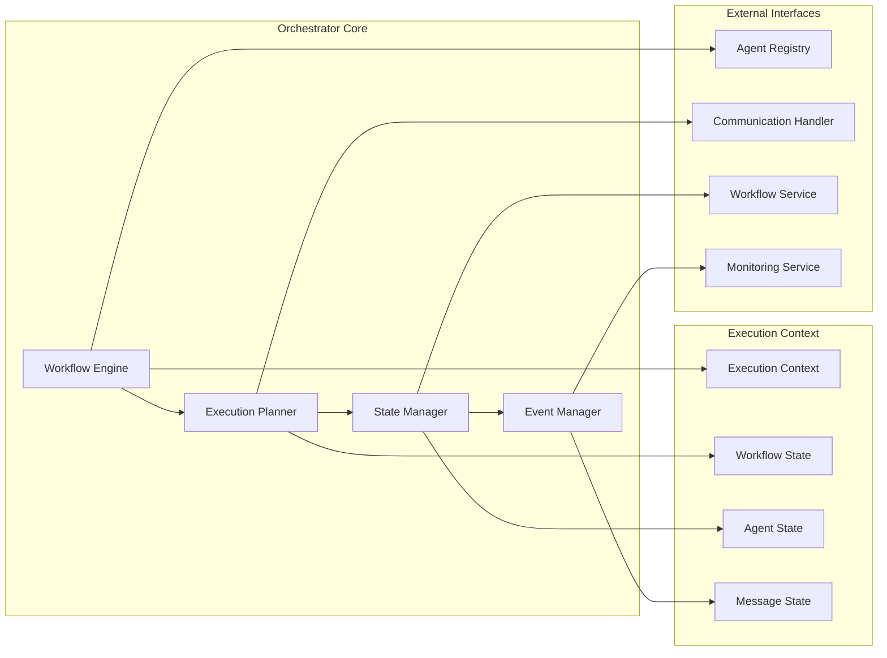

**Key Responsibilities:**
- Workflow execution planning and optimization
- Agent coordination and task distribution
- State management and persistence
- Event-driven workflow progression
- Error handling and recovery

#### 2. Communication Handler Architecture

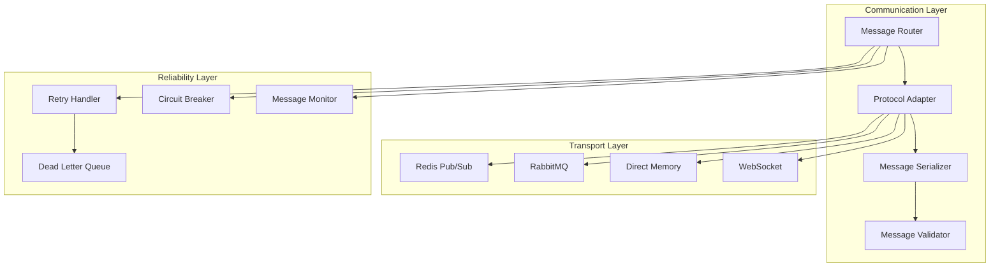

**Key Features:**
- Protocol-agnostic message routing
- Pluggable transport mechanisms
- Message reliability and delivery guarantees
- Circuit breaker pattern for fault tolerance
- Message monitoring and metrics

#### 3. Agent Registry Architecture

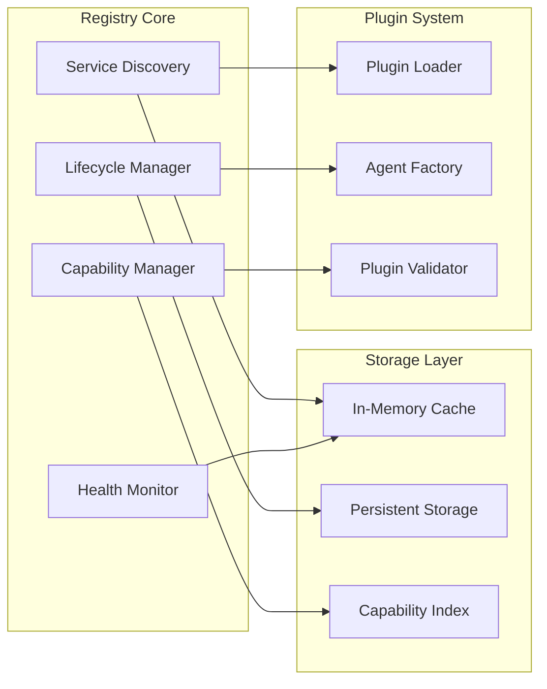

**Key Capabilities:**
- Dynamic agent registration and deregistration
- Capability-based agent discovery
- Health monitoring and status tracking
- Plugin-based agent loading
- Load balancing and agent selection
## Service Boundaries and Communication

### Service Boundary Definition

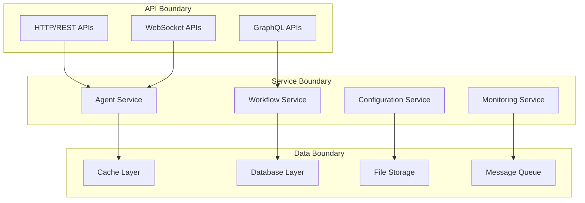

### Communication Patterns

#### 1. Synchronous Communication
- **HTTP/REST**: Client-API communication
- **Direct Method Calls**: Internal service communication
- **Database Queries**: Data persistence operations

#### 2. Asynchronous Communication
- **Message Queues**: Agent-to-agent communication
- **Event Streams**: Workflow state changes
- **Pub/Sub**: System-wide notifications

#### 3. Communication Protocols

| Protocol | Use Case | Reliability | Performance |
|----------|----------|-------------|-------------|
| **HTTP/REST** | External API access | High | Medium |
| **WebSocket** | Real-time updates | Medium | High |
| **Redis Pub/Sub** | Fast messaging | Medium | Very High |
| **RabbitMQ** | Reliable messaging | Very High | Medium |
| **Direct Memory** | Local communication | Very High | Very High |

## Data Flow Architecture

### Workflow Execution Data Flow

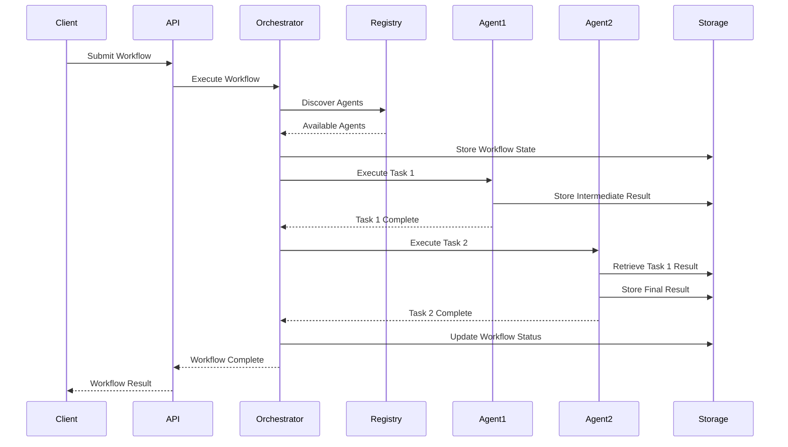

### Message Flow Patterns

#### 1. Request-Response Pattern
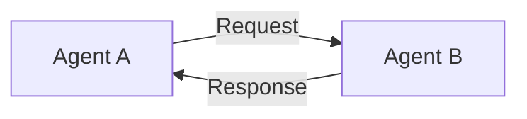

#### 2. Publish-Subscribe Pattern
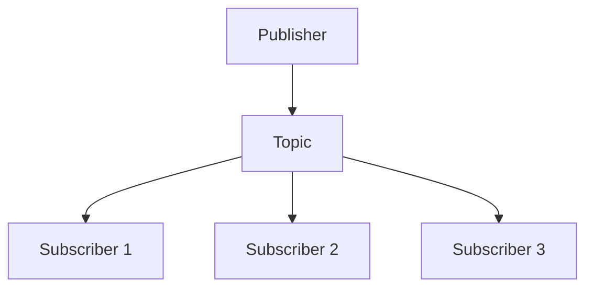

#### 3. Event Sourcing Pattern
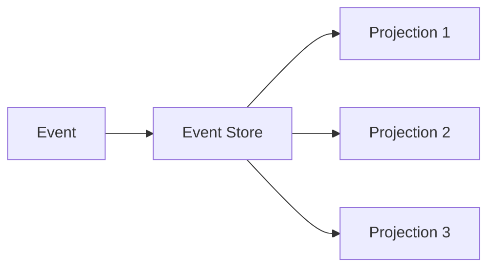
## API Layer Architecture

### FastAPI Application Structure

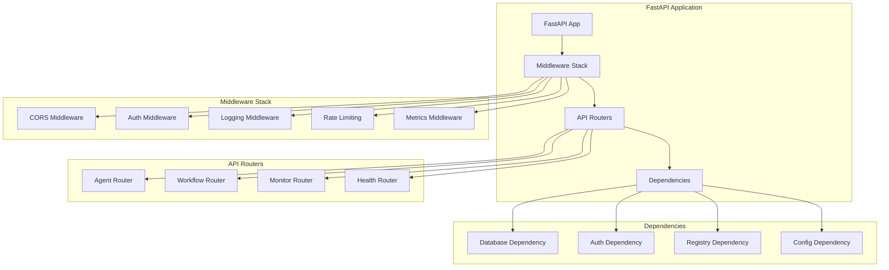

### API Endpoint Design

#### 1. Agent Management Endpoints

| Method | Endpoint | Description | Request Model | Response Model |
|--------|----------|-------------|---------------|----------------|
| POST | `/api/v1/agents` | Create agent | `AgentCreateRequest` | `AgentResponse` |
| GET | `/api/v1/agents` | List agents | - | `List[AgentResponse]` |
| GET | `/api/v1/agents/{id}` | Get agent | - | `AgentResponse` |
| PUT | `/api/v1/agents/{id}` | Update agent | `AgentUpdateRequest` | `AgentResponse` |
| DELETE | `/api/v1/agents/{id}` | Delete agent | - | `MessageResponse` |
| POST | `/api/v1/agents/{id}/message` | Send message | `MessageRequest` | `MessageResponse` |

#### 2. Workflow Management Endpoints

| Method | Endpoint | Description | Request Model | Response Model |
|--------|----------|-------------|---------------|----------------|
| POST | `/api/v1/workflows` | Create workflow | `WorkflowCreateRequest` | `WorkflowResponse` |
| GET | `/api/v1/workflows` | List workflows | - | `List[WorkflowResponse]` |
| GET | `/api/v1/workflows/{id}` | Get workflow | - | `WorkflowResponse` |
| POST | `/api/v1/workflows/{id}/execute` | Execute workflow | `ExecutionRequest` | `ExecutionResponse` |
| GET | `/api/v1/workflows/{id}/status` | Get status | - | `StatusResponse` |
| POST | `/api/v1/workflows/{id}/cancel` | Cancel workflow | - | `MessageResponse` |

### Request/Response Models

```python
# Agent Models
class AgentCreateRequest(BaseModel):
    agent_type: str
    name: str
    config: Dict[str, Any]
    capabilities: List[str]

class AgentResponse(BaseModel):
    id: str
    agent_type: str
    name: str
    status: AgentStatus
    capabilities: List[str]
    created_at: datetime
    updated_at: datetime

# Workflow Models
class WorkflowCreateRequest(BaseModel):
    name: str
    description: str
    steps: List[WorkflowStep]
    dependencies: Dict[str, List[str]]
    config: Dict[str, Any]

class WorkflowResponse(BaseModel):
    id: str
    name: str
    status: WorkflowStatus
    steps: List[WorkflowStep]
    created_at: datetime
    updated_at: datetime
```
## Database and Storage Architecture

### Database Design

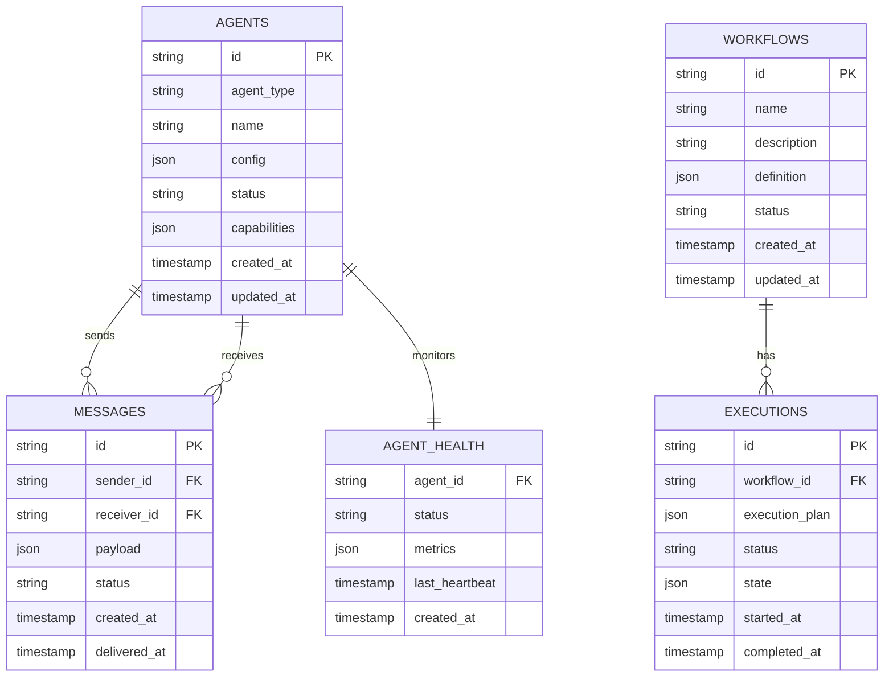

### Storage Strategy

#### 1. Primary Database (PostgreSQL)
- **Agents**: Agent metadata and configuration
- **Workflows**: Workflow definitions and execution history
- **Messages**: Message audit trail and delivery status
- **Health**: Agent health and monitoring data

#### 2. Cache Layer (Redis)
- **Agent Registry**: Fast agent lookup and discovery
- **Workflow State**: Active workflow execution state
- **Message Queue**: Temporary message storage
- **Session Data**: User session and authentication tokens

#### 3. File Storage
- **Workflow Artifacts**: Large workflow inputs/outputs
- **Logs**: Application and agent logs
- **Backups**: Database and configuration backups
- **Plugins**: Agent plugin binaries and configurations

### Data Partitioning Strategy

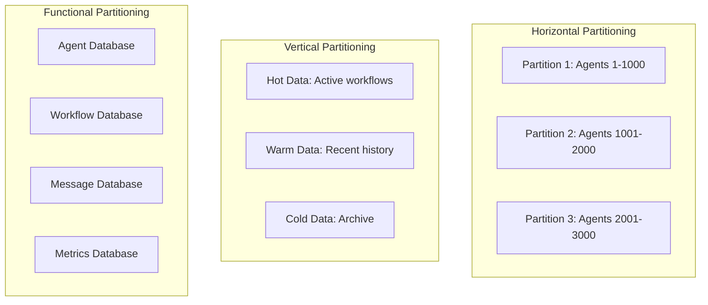
## Security Architecture

### Authentication and Authorization Flow

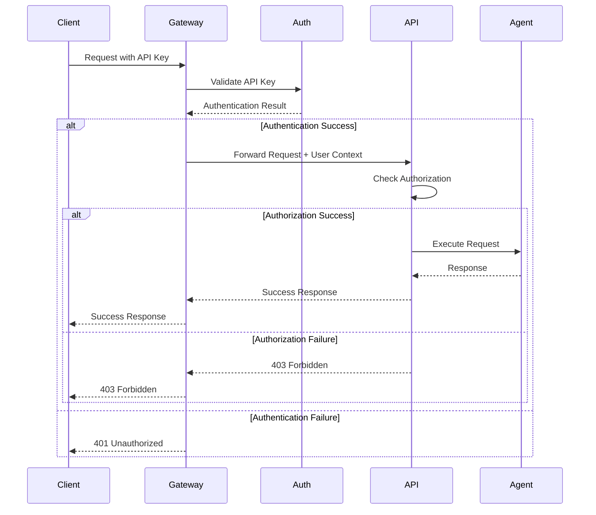

### Security Layers

#### 1. Network Security
- **TLS/SSL**: All communication encrypted in transit
- **VPN**: Secure network access for internal services
- **Firewall**: Network-level access control
- **DDoS Protection**: Rate limiting and traffic filtering

#### 2. Application Security
- **API Authentication**: API key and JWT token validation
- **Authorization**: Role-based access control (RBAC)
- **Input Validation**: Comprehensive input sanitization
- **Output Encoding**: Prevent injection attacks

#### 3. Data Security
- **Encryption at Rest**: Database and file encryption
- **Key Management**: Secure key storage and rotation
- **Data Masking**: Sensitive data protection
- **Audit Logging**: Complete audit trail

### Security Configuration

```python
# Security Settings
class SecuritySettings:
    # Authentication
    JWT_SECRET_KEY: str
    JWT_ALGORITHM: str = "HS256"
    JWT_EXPIRATION: int = 3600
    
    # API Security
    API_KEY_HEADER: str = "X-API-Key"
    RATE_LIMIT_PER_MINUTE: int = 100
    
    # Encryption
    ENCRYPTION_KEY: str
    HASH_ALGORITHM: str = "SHA-256"
    
    # CORS
    CORS_ORIGINS: List[str]
    CORS_METHODS: List[str] = ["GET", "POST", "PUT", "DELETE"]
    
    # Security Headers
    SECURITY_HEADERS: Dict[str, str] = {
        "X-Content-Type-Options": "nosniff",
        "X-Frame-Options": "DENY",
        "X-XSS-Protection": "1; mode=block"
    }
```
## Extensibility Design

### Plugin Architecture

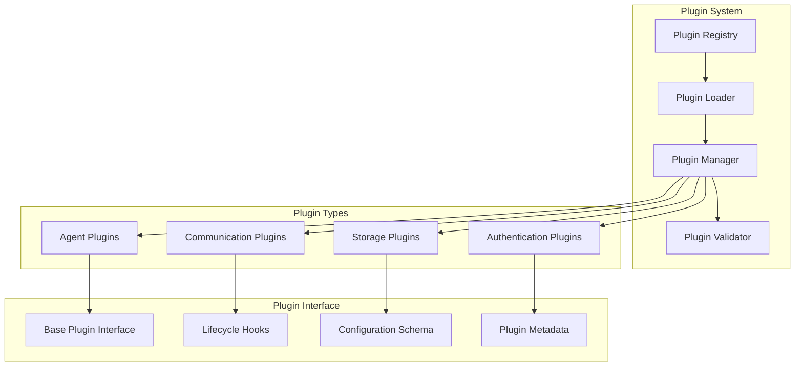

### Plugin Development Framework

#### 1. Base Plugin Interface

```python
from abc import ABC, abstractmethod
from typing import Dict, Any, List

class BasePlugin(ABC):
    """Base interface for all plugins"""
    
    @abstractmethod
    def get_metadata(self) -> Dict[str, Any]:
        """Return plugin metadata"""
        pass
    
    @abstractmethod
    def initialize(self, config: Dict[str, Any]) -> None:
        """Initialize plugin with configuration"""
        pass
    
    @abstractmethod
    def cleanup(self) -> None:
        """Cleanup plugin resources"""
        pass
    
    @abstractmethod
    def get_capabilities(self) -> List[str]:
        """Return plugin capabilities"""
        pass

class AgentPlugin(BasePlugin):
    """Base interface for agent plugins"""
    
    @abstractmethod
    async def process_message(self, message: Dict[str, Any]) -> Dict[str, Any]:
        """Process incoming message"""
        pass
    
    @abstractmethod
    def get_agent_type(self) -> str:
        """Return agent type identifier"""
        pass
```

#### 2. Plugin Configuration Schema

```python
from pydantic import BaseModel
from typing import Optional, Dict, Any, List

class PluginMetadata(BaseModel):
    name: str
    version: str
    description: str
    author: str
    license: str
    dependencies: List[str] = []
    
class PluginConfig(BaseModel):
    metadata: PluginMetadata
    entry_point: str
    config_schema: Dict[str, Any]
    capabilities: List[str]
    requirements: List[str] = []
    
class PluginManifest(BaseModel):
    plugin_id: str
    config: PluginConfig
    enabled: bool = True
    load_priority: int = 100
```

### Configuration Management Architecture

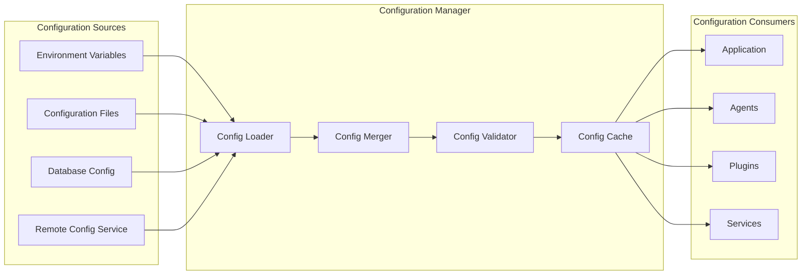
## Scalability Patterns

### Horizontal Scaling Architecture

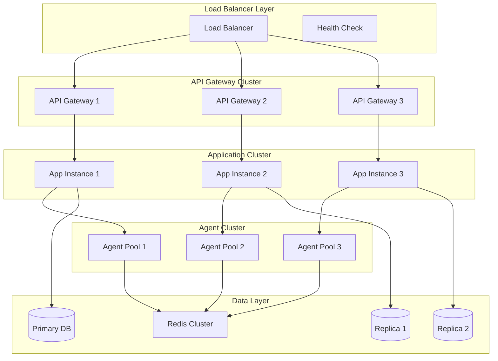

### Auto-Scaling Strategies

#### 1. Reactive Scaling
- **CPU/Memory Thresholds**: Scale based on resource utilization
- **Queue Length**: Scale based on message queue depth
- **Response Time**: Scale based on API response times
- **Error Rate**: Scale based on error frequency

#### 2. Predictive Scaling
- **Historical Patterns**: Scale based on historical usage
- **Scheduled Events**: Pre-scale for known events
- **Machine Learning**: AI-driven scaling predictions
- **Business Metrics**: Scale based on business indicators

#### 3. Scaling Configuration

```python
class ScalingConfig(BaseModel):
    # Reactive Scaling
    cpu_threshold_scale_up: float = 70.0
    cpu_threshold_scale_down: float = 30.0
    memory_threshold_scale_up: float = 80.0
    memory_threshold_scale_down: float = 40.0
    
    # Queue-based Scaling
    queue_length_threshold: int = 100
    queue_processing_time_threshold: float = 30.0
    
    # Instance Limits
    min_instances: int = 2
    max_instances: int = 50
    scale_up_cooldown: int = 300  # seconds
    scale_down_cooldown: int = 600  # seconds
    
    # Predictive Scaling
    enable_predictive_scaling: bool = True
    prediction_window: int = 3600  # seconds
    confidence_threshold: float = 0.8
```
## Technical Architecture Patterns

### Dependency Injection Pattern

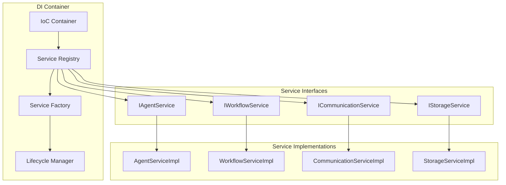

### Event-Driven Architecture

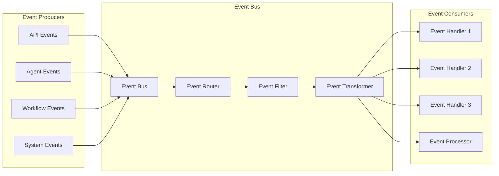

### Async/Await Patterns

#### 1. Async Service Pattern

```python
from abc import ABC, abstractmethod
from typing import Any, Dict, List
import asyncio

class AsyncService(ABC):
    """Base async service pattern"""
    
    def __init__(self):
        self._tasks: List[asyncio.Task] = []
        self._shutdown_event = asyncio.Event()
    
    async def start(self) -> None:
        """Start the service"""
        await self.initialize()
        self._tasks.append(asyncio.create_task(self._run()))
    
    async def stop(self) -> None:
        """Stop the service gracefully"""
        self._shutdown_event.set()
        await asyncio.gather(*self._tasks, return_exceptions=True)
        await self.cleanup()
    
    @abstractmethod
    async def initialize(self) -> None:
        """Initialize service resources"""
        pass
    
    @abstractmethod
    async def cleanup(self) -> None:
        """Cleanup service resources"""
        pass
    
    @abstractmethod
    async def _run(self) -> None:
        """Main service loop"""
        pass

class AsyncAgentService(AsyncService):
    """Async agent service implementation"""
    
    async def process_message_async(self, message: Dict[str, Any]) -> Dict[str, Any]:
        """Process message asynchronously"""
        # Simulate async processing
        await asyncio.sleep(0.1)
        return {"status": "processed", "result": message}
    
    async def _run(self) -> None:
        """Main message processing loop"""
        while not self._shutdown_event.is_set():
            try:
                # Process messages from queue
                message = await self.get_next_message()
                if message:
                    result = await self.process_message_async(message)
                    await self.send_response(result)
                else:
                    await asyncio.sleep(0.1)
            except Exception as e:
                await self.handle_error(e)
```

### Message Queue Integration

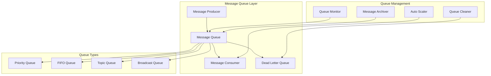

### Caching Strategy Architecture

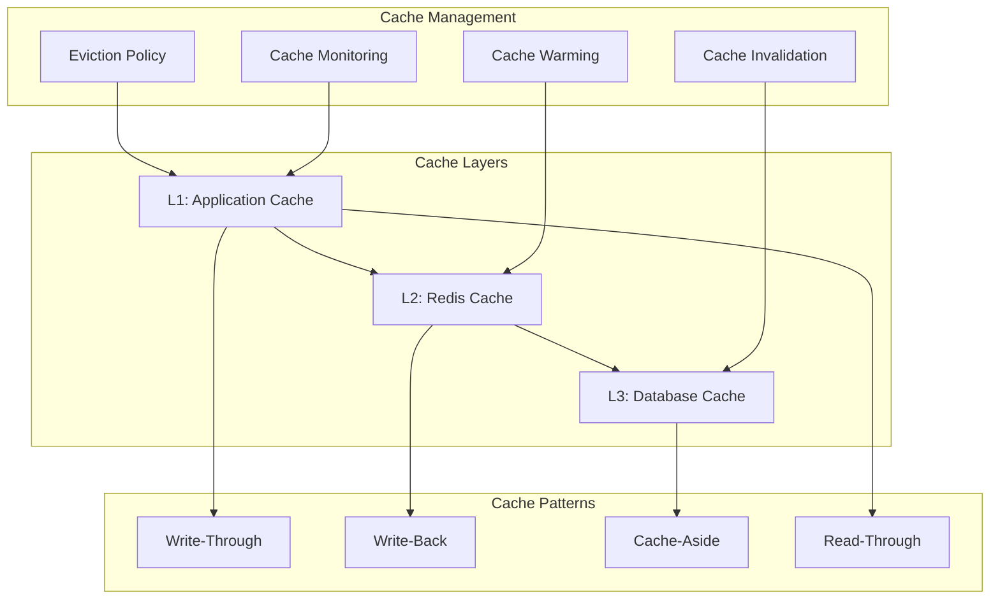
## Monitoring and Observability

### Observability Architecture

```mermaid
graph TB
    subgraph "Data Collection"
        Metrics[Metrics Collection]
        Logs[Log Aggregation]
        Traces[Distributed Tracing]
        Events[Event Tracking]
    end

    subgraph "Processing Layer"
        Processor[Data Processor]
        Enricher[Data Enricher]
        Correlator[Event Correlator]
        Aggregator[Metrics Aggregator]
    end

    subgraph "Storage Layer"
        TSDB[Time Series DB]
        LogStore[Log Storage]
        TraceStore[Trace Storage]
        EventStore[Event Storage]
    end

    subgraph "Visualization Layer"
        Dashboard[Dashboards]
        Alerts[Alert Manager]
        Reports[Report Generator]
        Analytics[Analytics Engine]
    end

    Metrics --> Processor
    Logs --> Enricher
    Traces --> Correlator
    Events --> Aggregator
    
    Processor --> TSDB
    Enricher --> LogStore
    Correlator --> TraceStore
    Aggregator --> EventStore
    
    TSDB --> Dashboard
    LogStore --> Alerts
    TraceStore --> Reports
    EventStore --> Analytics
```

### Metrics Collection Strategy

#### 1. Application Metrics

```python
from prometheus_client import Counter, Histogram, Gauge, Info
from typing import Dict, Any

class ApplicationMetrics:
    """Application-level metrics collection"""
    
    # Request metrics
    request_count = Counter(
        'http_requests_total',
        'Total HTTP requests',
        ['method', 'endpoint', 'status']
    )
    
    request_duration = Histogram(
        'http_request_duration_seconds',
        'HTTP request duration',
        ['method', 'endpoint']
    )
    
    # Agent metrics
    active_agents = Gauge(
        'active_agents_total',
        'Number of active agents',
        ['agent_type']
    )
    
    agent_processing_time = Histogram(
        'agent_processing_duration_seconds',
        'Agent message processing time',
        ['agent_id', 'agent_type']
    )
    
    # Workflow metrics
    workflow_executions = Counter(
        'workflow_executions_total',
        'Total workflow executions',
        ['workflow_type', 'status']
    )
    
    workflow_duration = Histogram(
        'workflow_duration_seconds',
        'Workflow execution duration',
        ['workflow_type']
    )
    
    # System metrics
    system_info = Info(
        'system_info',
        'System information'
    )
    
    memory_usage = Gauge(
        'memory_usage_bytes',
        'Memory usage in bytes',
        ['component']
    )
```

#### 2. Business Metrics

```python
class BusinessMetrics:
    """Business-level metrics collection"""
    
    # Agent performance
    agent_success_rate = Gauge(
        'agent_success_rate',
        'Agent task success rate',
        ['agent_type']
    )
    
    agent_throughput = Gauge(
        'agent_throughput_per_second',
        'Agent message throughput',
        ['agent_type']
    )
    
    # Workflow performance
    workflow_success_rate = Gauge(
        'workflow_success_rate',
        'Workflow execution success rate',
        ['workflow_type']
    )
    
    workflow_step_failures = Counter(
        'workflow_step_failures_total',
        'Workflow step failures',
        ['workflow_type', 'step_name']
    )
    
    # Resource utilization
    resource_utilization = Gauge(
        'resource_utilization_percent',
        'Resource utilization percentage',
        ['resource_type', 'component']
    )
```

### Logging Architecture

#### 1. Structured Logging

```python
import structlog
from typing import Dict, Any

class StructuredLogger:
    """Structured logging implementation"""
    
    def __init__(self, component: str):
        self.logger = structlog.get_logger(component)
    
    def log_agent_event(self, agent_id: str, event_type: str, **kwargs):
        """Log agent-related events"""
        self.logger.info(
            "agent_event",
            agent_id=agent_id,
            event_type=event_type,
            **kwargs
        )
    
    def log_workflow_event(self, workflow_id: str, event_type: str, **kwargs):
        """Log workflow-related events"""
        self.logger.info(
            "workflow_event",
            workflow_id=workflow_id,
            event_type=event_type,
            **kwargs
        )
    
    def log_error(self, error: Exception, context: Dict[str, Any]):
        """Log errors with context"""
        self.logger.error(
            "error_occurred",
            error_type=type(error).__name__,
            error_message=str(error),
            **context
        )
```

#### 2. Log Correlation

```python
import uuid
from contextvars import ContextVar

# Correlation ID context variable
correlation_id: ContextVar[str] = ContextVar('correlation_id')

class CorrelationMiddleware:
    """Middleware for request correlation"""
    
    async def __call__(self, request, call_next):
        # Generate or extract correlation ID
        corr_id = request.headers.get('X-Correlation-ID', str(uuid.uuid4()))
        correlation_id.set(corr_id)
        
        # Add to response headers
        response = await call_next(request)
        response.headers['X-Correlation-ID'] = corr_id
        
        return response
```

### Distributed Tracing

```mermaid
sequenceDiagram
    participant Client
    participant API
    participant Orchestrator
    participant Agent1
    participant Agent2
    participant Database

    Note over Client,Database: Trace ID: abc123
    
    Client->>+API: Request (Span: api-request)
    API->>+Orchestrator: Execute Workflow (Span: workflow-execution)
    Orchestrator->>+Agent1: Process Task (Span: agent1-processing)
    Agent1->>+Database: Store Data (Span: db-write)
    Database-->>-Agent1: Success
    Agent1-->>-Orchestrator: Task Complete
    Orchestrator->>+Agent2: Process Task (Span: agent2-processing)
    Agent2->>+Database: Read Data (Span: db-read)
    Database-->>-Agent2: Data
    Agent2-->>-Orchestrator: Task Complete
    Orchestrator-->>-API: Workflow Complete
    API-->>-Client: Response
```

### Health Check Architecture

```python
from enum import Enum
from typing import Dict, Any, List
from pydantic import BaseModel

class HealthStatus(Enum):
    HEALTHY = "healthy"
    DEGRADED = "degraded"
    UNHEALTHY = "unhealthy"

class HealthCheck(BaseModel):
    name: str
    status: HealthStatus
    message: str
    details: Dict[str, Any] = {}
    timestamp: datetime

class HealthMonitor:
    """System health monitoring"""
    
    def __init__(self):
        self.checks: Dict[str, callable] = {}
    
    def register_check(self, name: str, check_func: callable):
        """Register a health check"""
        self.checks[name] = check_func
    
    async def run_checks(self) -> List[HealthCheck]:
        """Run all health checks"""
        results = []
        
        for name, check_func in self.checks.items():
            try:
                result = await check_func()
                results.append(HealthCheck(
                    name=name,
                    status=HealthStatus.HEALTHY,
                    message="Check passed",
                    details=result,
                    timestamp=datetime.now()
                ))
            except Exception as e:
                results.append(HealthCheck(
                    name=name,
                    status=HealthStatus.UNHEALTHY,
                    message=str(e),
                    timestamp=datetime.now()
                ))
        
        return results
    
    async def check_database(self) -> Dict[str, Any]:
        """Database connectivity check"""
        # Implementation for database health check
        pass
    
    async def check_redis(self) -> Dict[str, Any]:
        """Redis connectivity check"""
        # Implementation for Redis health check
        pass
    
    async def check_agents(self) -> Dict[str, Any]:
        """Agent health check"""
        # Implementation for agent health check
        pass
```
## Error Handling and Resilience

### Error Handling Architecture

```mermaid
graph TB
    subgraph "Error Detection"
        Monitor[Error Monitor]
        Detector[Anomaly Detector]
        Validator[Input Validator]
        HealthCheck[Health Checker]
    end

    subgraph "Error Classification"
        Classifier[Error Classifier]
        Severity[Severity Assessor]
        Impact[Impact Analyzer]
        Recovery[Recovery Planner]
    end

    subgraph "Error Response"
        Handler[Error Handler]
        Retry[Retry Manager]
        Fallback[Fallback Handler]
        Circuit[Circuit Breaker]
    end

    subgraph "Error Recovery"
        Restart[Service Restart]
        Rollback[State Rollback]
        Compensation[Compensation]
        Escalation[Error Escalation]
    end

    Monitor --> Classifier
    Detector --> Severity
    Validator --> Impact
    HealthCheck --> Recovery
    
    Classifier --> Handler
    Severity --> Retry
    Impact --> Fallback
    Recovery --> Circuit
    
    Handler --> Restart
    Retry --> Rollback
    Fallback --> Compensation
    Circuit --> Escalation
```

### Resilience Patterns

#### 1. Circuit Breaker Pattern

```python
from enum import Enum
from typing import Callable, Any
import asyncio
from datetime import datetime, timedelta

class CircuitState(Enum):
    CLOSED = "closed"
    OPEN = "open"
    HALF_OPEN = "half_open"

class CircuitBreaker:
    """Circuit breaker implementation for fault tolerance"""
    
    def __init__(
        self,
        failure_threshold: int = 5,
        recovery_timeout: int = 60,
        expected_exception: type = Exception
    ):
        self.failure_threshold = failure_threshold
        self.recovery_timeout = recovery_timeout
        self.expected_exception = expected_exception
        
        self.failure_count = 0
        self.last_failure_time = None
        self.state = CircuitState.CLOSED
    
    async def call(self, func: Callable, *args, **kwargs) -> Any:
        """Execute function with circuit breaker protection"""
        
        if self.state == CircuitState.OPEN:
            if self._should_attempt_reset():
                self.state = CircuitState.HALF_OPEN
            else:
                raise Exception("Circuit breaker is OPEN")
        
        try:
            result = await func(*args, **kwargs)
            self._on_success()
            return result
        except self.expected_exception as e:
            self._on_failure()
            raise e
    
    def _should_attempt_reset(self) -> bool:
        """Check if circuit should attempt reset"""
        return (
            self.last_failure_time and
            datetime.now() - self.last_failure_time >= timedelta(seconds=self.recovery_timeout)
        )
    
    def _on_success(self):
        """Handle successful execution"""
        self.failure_count = 0
        self.state = CircuitState.CLOSED
    
    def _on_failure(self):
        """Handle failed execution"""
        self.failure_count += 1
        self.last_failure_time = datetime.now()
        
        if self.failure_count >= self.failure_threshold:
            self.state = CircuitState.OPEN
```

#### 2. Retry Pattern with Exponential Backoff

```python
import asyncio
import random
from typing import Callable, Any, Type, Tuple

class RetryManager:
    """Retry manager with exponential backoff"""
    
    def __init__(
        self,
        max_retries: int = 3,
        base_delay: float = 1.0,
        max_delay: float = 60.0,
        exponential_base: float = 2.0,
        jitter: bool = True
    ):
        self.max_retries = max_retries
        self.base_delay = base_delay
        self.max_delay = max_delay
        self.exponential_base = exponential_base
        self.jitter = jitter
    
    async def retry(
        self,
        func: Callable,
        *args,
        retryable_exceptions: Tuple[Type[Exception], ...] = (Exception,),
        **kwargs
    ) -> Any:
        """Execute function with retry logic"""
        
        last_exception = None
        
        for attempt in range(self.max_retries + 1):
            try:
                return await func(*args, **kwargs)
            except retryable_exceptions as e:
                last_exception = e
                
                if attempt == self.max_retries:
                    break
                
                delay = self._calculate_delay(attempt)
                await asyncio.sleep(delay)
        
        raise last_exception
    
    def _calculate_delay(self, attempt: int) -> float:
        """Calculate delay for retry attempt"""
        delay = self.base_delay * (self.exponential_base ** attempt)
        delay = min(delay, self.max_delay)
        
        if self.jitter:
            delay *= (0.5 + random.random() * 0.5)
        
        return delay
```

#### 3. Bulkhead Pattern

```python
import asyncio
from typing import Dict, Any
from concurrent.futures import ThreadPoolExecutor

class BulkheadManager:
    """Bulkhead pattern for resource isolation"""
    
    def __init__(self):
        self.pools: Dict[str, ThreadPoolExecutor] = {}
        self.semaphores: Dict[str, asyncio.Semaphore] = {}
    
    def create_pool(self, name: str, max_workers: int):
        """Create isolated thread pool"""
        self.pools[name] = ThreadPoolExecutor(max_workers=max_workers)
    
    def create_semaphore(self, name: str, max_concurrent: int):
        """Create semaphore for concurrency control"""
        self.semaphores[name] = asyncio.Semaphore(max_concurrent)
    
    async def execute_in_pool(self, pool_name: str, func: Callable, *args, **kwargs):
        """Execute function in isolated pool"""
        if pool_name not in self.pools:
            raise ValueError(f"Pool {pool_name} not found")
        
        loop = asyncio.get_event_loop()
        return await loop.run_in_executor(
            self.pools[pool_name],
            func,
            *args
        )
    
    async def execute_with_semaphore(self, semaphore_name: str, func: Callable, *args, **kwargs):
        """Execute function with semaphore protection"""
        if semaphore_name not in self.semaphores:
            raise ValueError(f"Semaphore {semaphore_name} not found")
        
        async with self.semaphores[semaphore_name]:
            return await func(*args, **kwargs)
```

### Error Recovery Strategies

#### 1. Compensation Pattern

```python
from abc import ABC, abstractmethod
from typing import List, Dict, Any

class CompensationAction(ABC):
    """Abstract compensation action"""
    
    @abstractmethod
    async def execute(self, context: Dict[str, Any]) -> None:
        """Execute compensation action"""
        pass
    
    @abstractmethod
    async def can_compensate(self, context: Dict[str, Any]) -> bool:
        """Check if compensation is possible"""
        pass

class WorkflowCompensator:
    """Workflow compensation manager"""
    
    def __init__(self):
        self.compensation_actions: List[CompensationAction] = []
    
    def add_compensation(self, action: CompensationAction):
        """Add compensation action"""
        self.compensation_actions.append(action)
    
    async def compensate(self, context: Dict[str, Any]) -> bool:
        """Execute compensation actions in reverse order"""
        success = True
        
        for action in reversed(self.compensation_actions):
            try:
                if await action.can_compensate(context):
                    await action.execute(context)
            except Exception as e:
                success = False
                # Log compensation failure
                
        return success

class AgentTaskCompensation(CompensationAction):
    """Compensation for agent task execution"""
    
    def __init__(self, agent_id: str, task_id: str):
        self.agent_id = agent_id
        self.task_id = task_id
    
    async def execute(self, context: Dict[str, Any]) -> None:
        """Compensate agent task"""
        # Implementation for task compensation
        pass
    
    async def can_compensate(self, context: Dict[str, Any]) -> bool:
        """Check if task can be compensated"""
        # Implementation for compensation check
        return True
```

#### 2. Graceful Degradation

```python
from typing import Optional, Callable, Any

class GracefulDegradation:
    """Graceful degradation manager"""
    
    def __init__(self):
        self.fallback_handlers: Dict[str, Callable] = {}
        self.degradation_levels: Dict[str, int] = {}
    
    def register_fallback(self, service_name: str, fallback_func: Callable):
        """Register fallback handler for service"""
        self.fallback_handlers[service_name] = fallback_func
    
    def set_degradation_level(self, service_name: str, level: int):
        """Set degradation level for service"""
        self.degradation_levels[service_name] = level
    
    async def execute_with_fallback(
        self,
        service_name: str,
        primary_func: Callable,
        *args,
        **kwargs
    ) -> Any:
        """Execute function with fallback support"""
        
        try:
            # Check degradation level
            degradation_level = self.degradation_levels.get(service_name, 0)
            
            if degradation_level > 0:
                # Use fallback if degraded
                if service_name in self.fallback_handlers:
                    return await self.fallback_handlers[service_name](*args, **kwargs)
                else:
                    raise Exception(f"Service {service_name} is degraded and no fallback available")
            
            # Execute primary function
            return await primary_func(*args, **kwargs)
            
        except Exception as e:
            # Fallback on error
            if service_name in self.fallback_handlers:
                return await self.fallback_handlers[service_name](*args, **kwargs)
            else:
                raise e
```
## Implementation Guidelines

### Development Workflow

#### 1. Project Setup and Structure

```bash
# Project initialization
mkdir fastapi_multiagent
cd fastapi_multiagent

# Virtual environment setup
python -m venv venv
source venv/bin/activate  # On Windows: venv\Scripts\activate

# Install dependencies
pip install -r requirements.txt

# Environment configuration
cp .env.example .env
# Edit .env with your configuration

# Database setup
python scripts/setup_database.py

# Run tests
python -m pytest tests/

# Start development server
python scripts/start_dev.py
```

#### 2. Development Standards

```python
# Code Quality Standards
class DevelopmentStandards:
    """Development standards and guidelines"""
    
    # File size limits
    MAX_FILE_LINES = 500
    MAX_FUNCTION_LINES = 50
    MAX_CLASS_LINES = 200
    
    # Naming conventions
    CLASS_NAMING = "PascalCase"
    FUNCTION_NAMING = "snake_case"
    CONSTANT_NAMING = "UPPER_SNAKE_CASE"
    
    # Documentation requirements
    DOCSTRING_REQUIRED = True
    TYPE_HINTS_REQUIRED = True
    TEST_COVERAGE_MIN = 80
    
    # Code organization
    SINGLE_RESPONSIBILITY = True
    DEPENDENCY_INJECTION = True
    CONFIGURATION_EXTERNAL = True
```

### Testing Strategy Implementation

#### 1. Test Structure

```python
# Test organization
"""
tests/
├── unit/
│   ├── test_agents/
│   ├── test_core/
│   └── test_services/
├── integration/
│   ├── test_api/
│   └── test_workflows/
├── system/
│   ├── test_performance/
│   └── test_reliability/
└── fixtures/
    ├── agent_fixtures.py
    └── workflow_fixtures.py
"""

# Test base class
import pytest
from fastapi.testclient import TestClient
from unittest.mock import Mock, AsyncMock

class BaseTestCase:
    """Base test case with common setup"""
    
    @pytest.fixture(autouse=True)
    def setup(self):
        """Setup test environment"""
        self.mock_db = Mock()
        self.mock_redis = Mock()
        self.mock_agent_registry = Mock()
        self.mock_communication_handler = AsyncMock()
    
    @pytest.fixture
    def test_client(self):
        """FastAPI test client"""
        from app.main import create_application
        app = create_application()
        return TestClient(app)
    
    def create_test_agent(self, agent_type: str = "test_agent"):
        """Create test agent instance"""
        return {
            "id": "test-agent-1",
            "agent_type": agent_type,
            "name": "Test Agent",
            "status": "idle",
            "capabilities": ["test_capability"],
            "config": {"test_param": "test_value"}
        }
```

#### 2. TDD Implementation Pattern

```python
# TDD Test Example
class TestAgentOrchestrator(BaseTestCase):
    """Test agent orchestrator functionality"""
    
    def test_workflow_execution_success(self):
        """TDD Anchor: test_workflow_execution_success"""
        # Arrange
        workflow_definition = {
            "name": "test_workflow",
            "steps": [
                {
                    "id": "step1",
                    "agent_type": "data_agent",
                    "action": "process_data"
                }
            ]
        }
        
        orchestrator = AgentOrchestrator(
            self.mock_agent_registry,
            self.mock_communication_handler
        )
        
        # Act
        workflow_id = orchestrator.execute_workflow(workflow_definition)
        
        # Assert
        assert workflow_id is not None
        assert workflow_id in orchestrator.active_workflows
        assert orchestrator.active_workflows[workflow_id]["status"] == "running"
    
    def test_workflow_validation_failure(self):
        """TDD Anchor: test_workflow_validation"""
        # Arrange
        invalid_workflow = {"invalid": "definition"}
        orchestrator = AgentOrchestrator(
            self.mock_agent_registry,
            self.mock_communication_handler
        )
        
        # Act & Assert
        with pytest.raises(WorkflowValidationError):
            orchestrator.execute_workflow(invalid_workflow)
```

### Deployment Architecture

#### 1. Container Configuration

```dockerfile
# Multi-stage Dockerfile
FROM python:3.11-slim as base

# Install system dependencies
RUN apt-get update && apt-get install -y \
    gcc \
    postgresql-client \
    redis-tools \
    && rm -rf /var/lib/apt/lists/*

WORKDIR /app

# Development stage
FROM base as development
COPY requirements-dev.txt .
RUN pip install -r requirements-dev.txt
COPY . .
CMD ["uvicorn", "app.main:app", "--host", "0.0.0.0", "--port", "8000", "--reload"]

# Production stage
FROM base as production
COPY requirements.txt .
RUN pip install --no-cache-dir -r requirements.txt

# Create non-root user
RUN useradd --create-home --shell /bin/bash agent_user
USER agent_user

COPY --chown=agent_user:agent_user app/ ./app/

# Health check
HEALTHCHECK --interval=30s --timeout=10s --start-period=5s --retries=3 \
    CMD curl -f http://localhost:8000/health || exit 1

EXPOSE 8000
CMD ["uvicorn", "app.main:app", "--host", "0.0.0.0", "--port", "8000"]
```

#### 2. Docker Compose Configuration

```yaml
# docker-compose.yml
version: '3.8'

services:
  api:
    build:
      context: .
      target: production
    ports:
      - "8000:8000"
    environment:
      - DATABASE_URL=postgresql://postgres:password@db:5432/multiagent
      - REDIS_URL=redis://redis:6379
    depends_on:
      - db
      - redis
    networks:
      - multiagent-network

  db:
    image: postgres:15
    environment:
      - POSTGRES_DB=multiagent
      - POSTGRES_USER=postgres
      - POSTGRES_PASSWORD=password
    volumes:
      - postgres_data:/var/lib/postgresql/data
    networks:
      - multiagent-network

  redis:
    image: redis:7-alpine
    volumes:
      - redis_data:/data
    networks:
      - multiagent-network

  nginx:
    image: nginx:alpine
    ports:
      - "80:80"
      - "443:443"
    volumes:
      - ./nginx.conf:/etc/nginx/nginx.conf
      - ./ssl:/etc/nginx/ssl
    depends_on:
      - api
    networks:
      - multiagent-network

volumes:
  postgres_data:
  redis_data:

networks:
  multiagent-network:
    driver: bridge
```

### Performance Optimization Guidelines

#### 1. Database Optimization

```python
# Database optimization strategies
class DatabaseOptimization:
    """Database performance optimization"""
    
    # Connection pooling
    DATABASE_POOL_SIZE = 20
    DATABASE_MAX_OVERFLOW = 30
    DATABASE_POOL_TIMEOUT = 30
    
    # Query optimization
    USE_QUERY_CACHE = True
    ENABLE_QUERY_LOGGING = False  # Only in development
    
    # Indexing strategy
    REQUIRED_INDEXES = [
        "agents_agent_type_idx",
        "workflows_status_idx",
        "messages_sender_receiver_idx",
        "executions_workflow_id_idx"
    ]
    
    # Partitioning strategy
    PARTITION_TABLES = [
        "messages",  # Partition by date
        "executions",  # Partition by workflow_id
        "agent_health"  # Partition by agent_id
    ]
```

#### 2. Caching Strategy

```python
# Caching implementation
from functools import wraps
import redis
import json

class CacheManager:
    """Cache management for performance optimization"""
    
    def __init__(self, redis_client: redis.Redis):
        self.redis = redis_client
        self.default_ttl = 3600  # 1 hour
    
    def cache_result(self, key_prefix: str, ttl: int = None):
        """Decorator for caching function results"""
        def decorator(func):
            @wraps(func)
            async def wrapper(*args, **kwargs):
                # Generate cache key
                cache_key = f"{key_prefix}:{hash(str(args) + str(kwargs))}"
                
                # Try to get from cache
                cached_result = self.redis.get(cache_key)
                if cached_result:
                    return json.loads(cached_result)
                
                # Execute function and cache result
                result = await func(*args, **kwargs)
                self.redis.setex(
                    cache_key,
                    ttl or self.default_ttl,
                    json.dumps(result, default=str)
                )
                
                return result
            return wrapper
        return decorator
    
    @cache_result("agent_capabilities", ttl=1800)
    async def get_agent_capabilities(self, agent_id: str):
        """Cached agent capabilities lookup"""
        # Implementation
        pass
```

### Security Implementation Guidelines

#### 1. Authentication Implementation

```python
# JWT Authentication
from jose import JWTError, jwt
from passlib.context import CryptContext
from datetime import datetime, timedelta

class AuthenticationManager:
    """Authentication and authorization manager"""
    
    def __init__(self, secret_key: str, algorithm: str = "HS256"):
        self.secret_key = secret_key
        self.algorithm = algorithm
        self.pwd_context = CryptContext(schemes=["bcrypt"], deprecated="auto")
    
    def create_access_token(self, data: dict, expires_delta: timedelta = None):
        """Create JWT access token"""
        to_encode = data.copy()
        if expires_delta:
            expire = datetime.utcnow() + expires_delta
        else:
            expire = datetime.utcnow() + timedelta(minutes=15)
        
        to_encode.update({"exp": expire})
        encoded_jwt = jwt.encode(to_encode, self.secret_key, algorithm=self.algorithm)
        return encoded_jwt
    
    def verify_token(self, token: str):
        """Verify JWT token"""
        try:
            payload = jwt.decode(token, self.secret_key, algorithms=[self.algorithm])
            return payload
        except JWTError:
            return None
    
    def hash_password(self, password: str):
        """Hash password"""
        return self.pwd_context.hash(password)
    
    def verify_password(self, plain_password: str, hashed_password: str):
        """Verify password"""
        return self.pwd_context.verify(plain_password, hashed_password)
```

### Monitoring Implementation

#### 1. Metrics Collection Setup

```python
# Prometheus metrics setup
from prometheus_client import start_http_server, Counter, Histogram, Gauge
import time

class MetricsCollector:
    """Metrics collection for monitoring"""
    
    def __init__(self):
        # Initialize metrics
        self.request_count = Counter(
            'http_requests_total',
            'Total HTTP requests',
            ['method', 'endpoint', 'status']
        )
        
        self.request_duration = Histogram(
            'http_request_duration_seconds',
            'HTTP request duration'
        )
        
        self.active_agents = Gauge(
            'active_agents_total',
            'Number of active agents'
        )
    
    def start_metrics_server(self, port: int = 8001):
        """Start Prometheus metrics server"""
        start_http_server(port)
    
    def record_request(self, method: str, endpoint: str, status: int, duration: float):
        """Record HTTP request metrics"""
        self.request_count.labels(method=method, endpoint=endpoint, status=status).inc()
        self.request_duration.observe(duration)
    
    def update_agent_count(self, count: int):
        """Update active agent count"""
        self.active_agents.set(count)
```

## Conclusion

This architectural design document provides a comprehensive blueprint for implementing a scalable, secure, and maintainable FastAPI multi-agent system. The architecture emphasizes:

### Key Benefits

1. **Modularity**: Clear separation of concerns with components under 500 lines
2. **Scalability**: Horizontal scaling support for all major components
3. **Extensibility**: Plugin-based architecture for easy feature additions
4. **Reliability**: Comprehensive error handling and resilience patterns
5. **Observability**: Built-in monitoring, logging, and tracing capabilities
6. **Security**: Multi-layered security with authentication and authorization
7. **Testability**: TDD approach with comprehensive testing strategy

### Implementation Roadmap

1. **Phase 1**: Core infrastructure setup (database, cache, message queue)
2. **Phase 2**: Basic agent framework and communication layer
3. **Phase 3**: Workflow orchestration and API layer
4. **Phase 4**: Plugin system and extensibility features
5. **Phase 5**: Monitoring, security, and production optimization
6. **Phase 6**: Advanced features and scaling optimizations

### Success Metrics

- **Performance**: Sub-100ms API response times, 1000+ concurrent agents
- **Reliability**: 99.9% uptime, automatic failure recovery
- **Scalability**: Linear scaling to 10,000+ agents
- **Security**: Zero security vulnerabilities, comprehensive audit logging
- **Maintainability**: 80%+ test coverage, modular codebase

This architecture provides a solid foundation for building a production-ready multi-agent system that can evolve with changing requirements while maintaining high performance and reliability standards.