# FastAPI Multi-Agent System - System Diagrams

## Component Relationship Diagrams

### 1. High-Level System Architecture

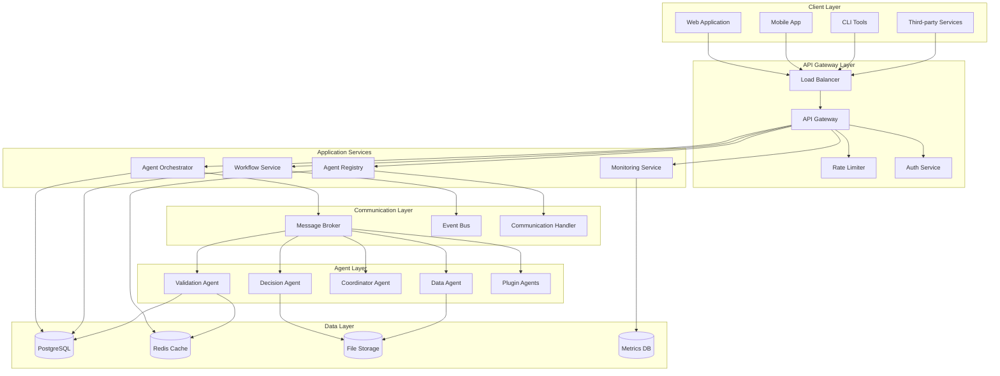

### 2. Agent Communication Flow

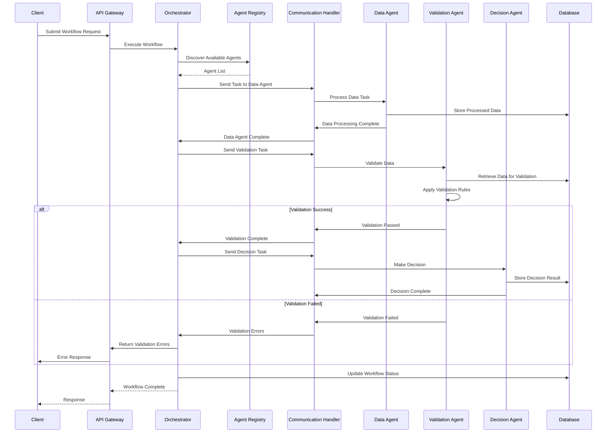

### 3. Data Flow Architecture

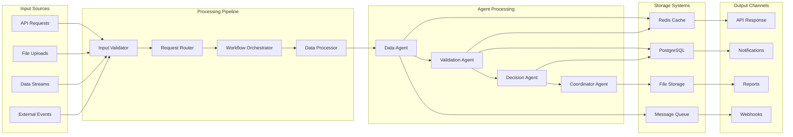

## Validation Agent Architecture

### 1. Validation Agent Internal Architecture

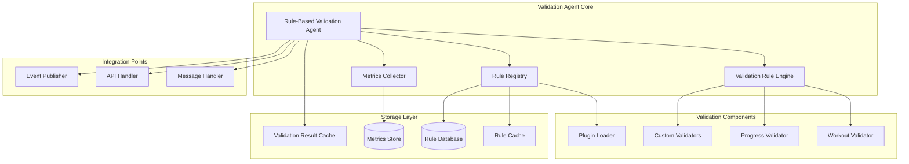

### 2. Validation Flow with Other Agents

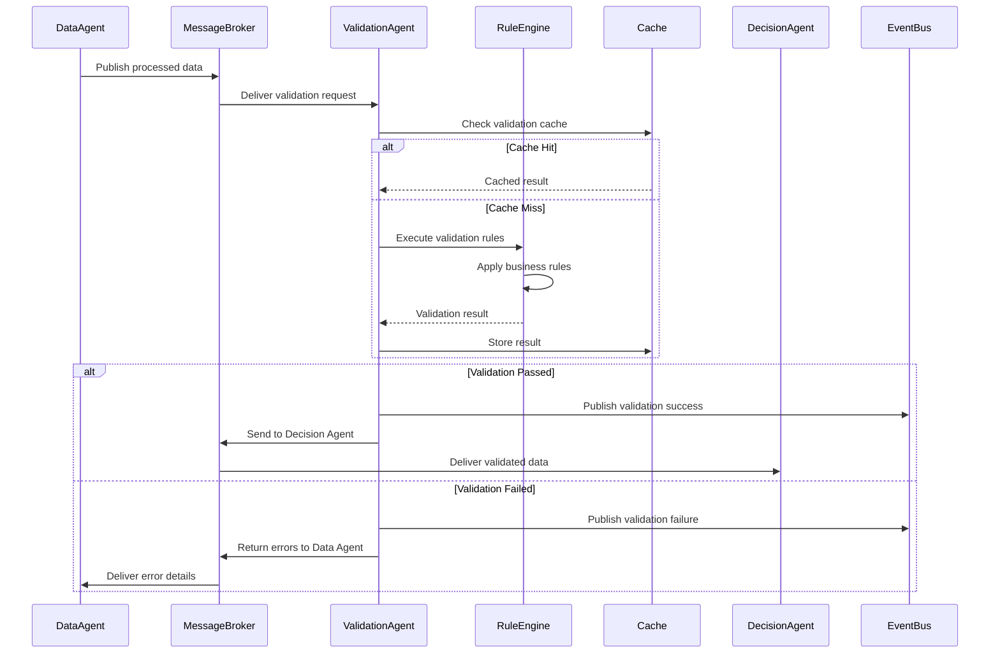

### 3. Validation Rule Management

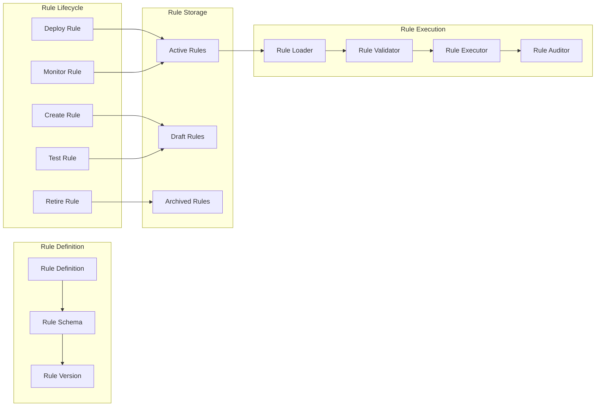

## Deployment Architecture Diagrams

### 1. Container Deployment Architecture

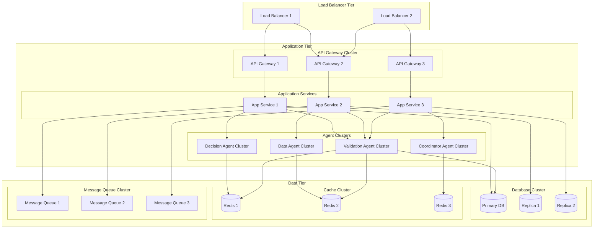

### 2. Kubernetes Deployment

```mermaid
graph TB
    subgraph "Kubernetes Cluster"
        subgraph "Ingress"
            Ingress[Ingress Controller]
            TLS[TLS Termination]
        end

        subgraph "API Namespace"
            APIDeployment[API Deployment]
            APIService[API Service]
            APIConfigMap[API ConfigMap]
            APISecret[API Secret]
        end

        subgraph "Agent Namespace"
            AgentDeployment[Agent Deployment]
            AgentService[Agent Service]
            AgentHPA[Agent HPA]
            AgentPDB[Agent PDB]
        end

        subgraph "Data Namespace"
            PostgreSQLSS[PostgreSQL StatefulSet]
            RedisSS[Redis StatefulSet]
            PVC[Persistent Volume Claims]
        end

        subgraph "Monitoring Namespace"
            Prometheus[Prometheus]
            Grafana[Grafana]
            AlertManager[Alert Manager]
        end
    end

    Ingress --> APIService
    TLS --> Ingress

    APIService --> APIDeployment
    APIConfigMap --> APIDeployment
    APISecret --> APIDeployment

    APIDeployment --> AgentService
    AgentService --> AgentDeployment
    AgentHPA --> AgentDeployment
    AgentPDB --> AgentDeployment

    AgentDeployment --> PostgreSQLSS
    AgentDeployment --> RedisSS
    PostgreSQLSS --> PVC
    RedisSS --> PVC

    Prometheus --> APIDeployment
    Prometheus --> AgentDeployment
    Grafana --> Prometheus
    AlertManager --> Prometheus
```

## Security Architecture Diagrams

### 1. Security Layers

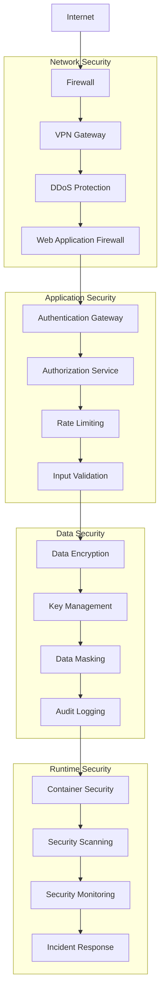

### 2. Authentication Flow

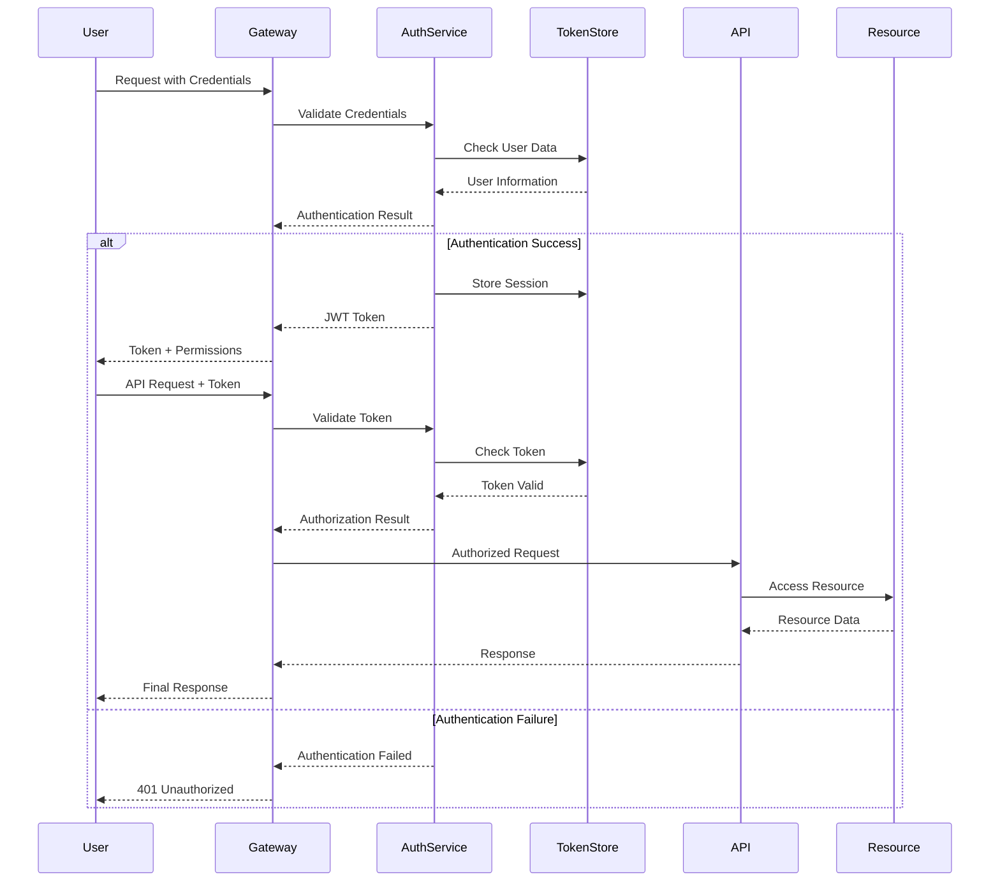

## Monitoring and Observability Diagrams

### 1. Observability Stack

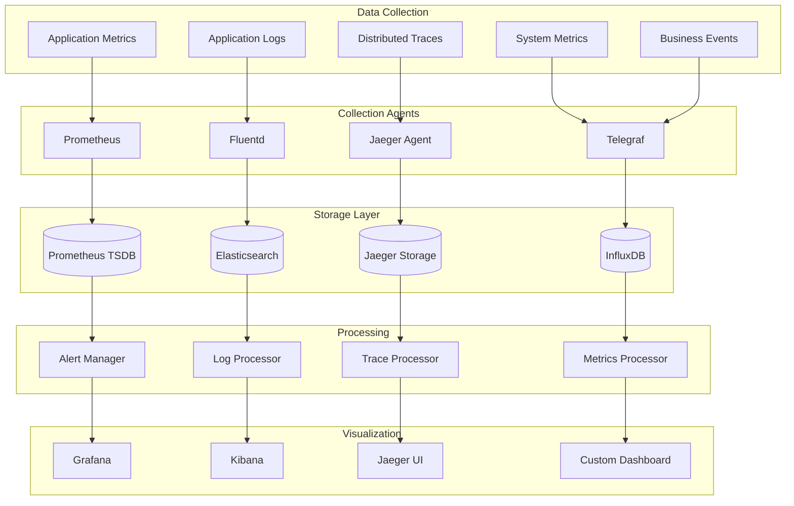

### 2. Health Check Architecture

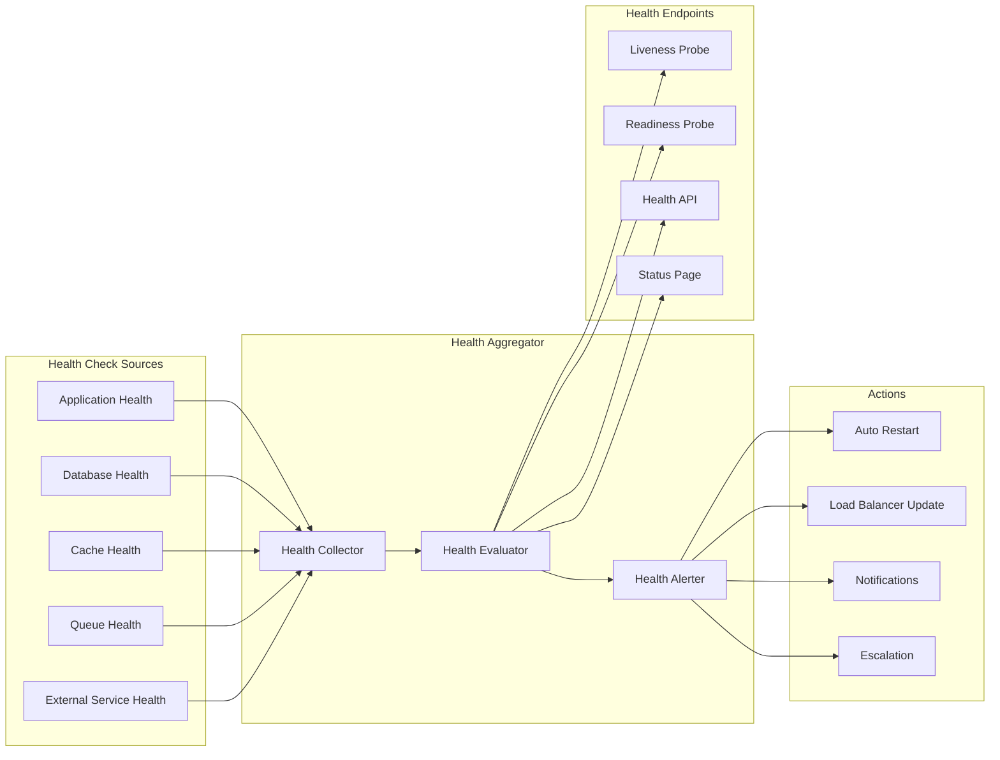

## Scalability Architecture Diagrams

### 1. Auto-Scaling Architecture

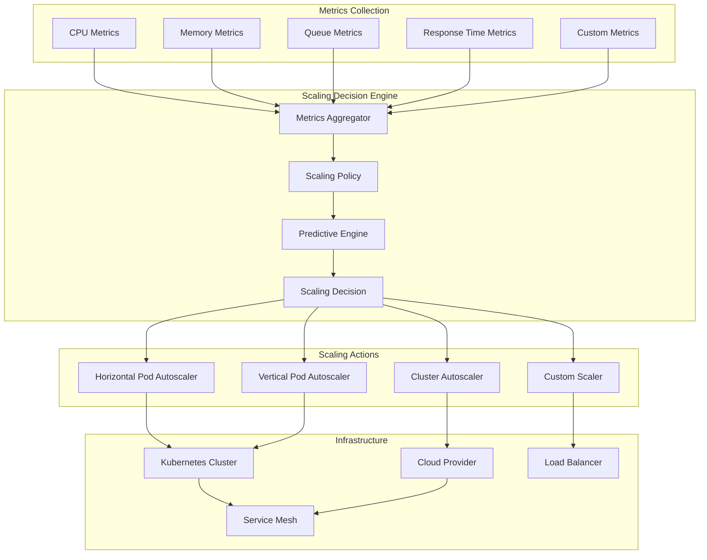

### 2. Multi-Region Deployment

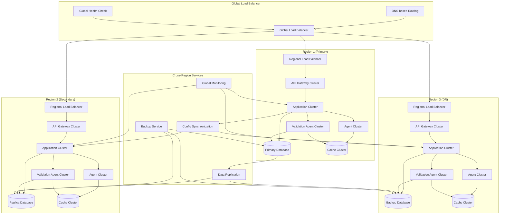

These diagrams provide comprehensive visual representations of the FastAPI multi-agent system architecture, covering all major aspects from high-level system design to detailed deployment and scaling strategies.