# Rule-Based Validation Agent Integration Architecture

## Executive Summary

The Rule-Based Validation Agent integrates into the FastAPI multi-agent system as a specialized agent providing validation services across the platform. This document outlines the architectural integration patterns, service boundaries, deployment considerations, and extension points for seamless integration with the existing multi-agent architecture.

## Table of Contents

1. [Integration Overview](#integration-overview)
2. [Service Architecture](#service-architecture)
3. [API Integration Architecture](#api-integration-architecture)
4. [Deployment Architecture](#deployment-architecture)
5. [Scalability Architecture](#scalability-architecture)
6. [Security Architecture](#security-architecture)
7. [Extension Architecture](#extension-architecture)
8. [Integration with Existing Agents](#integration-with-existing-agents)
9. [Monitoring and Observability](#monitoring-and-observability)
10. [Error Handling Architecture](#error-handling-architecture)

## Integration Overview

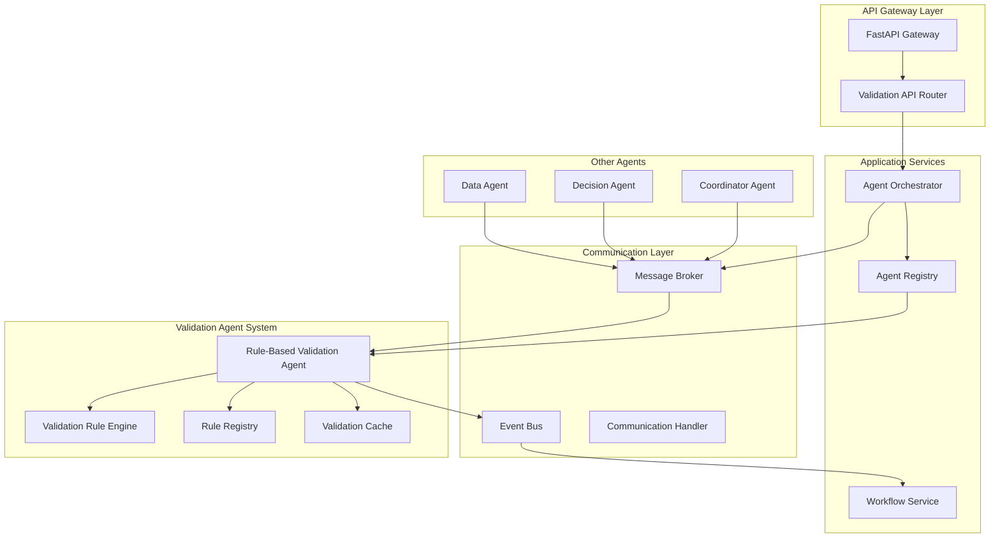

## Service Architecture

### 1. Validation Agent Service Boundaries

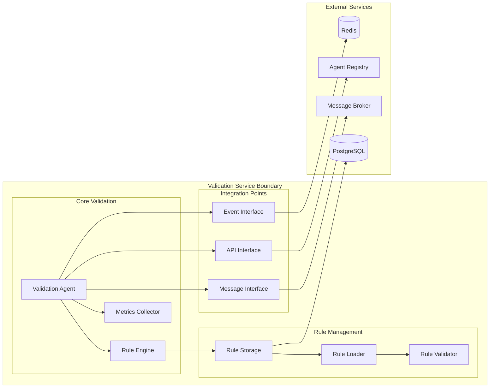

### 2. Communication Patterns

#### Synchronous Validation Pattern
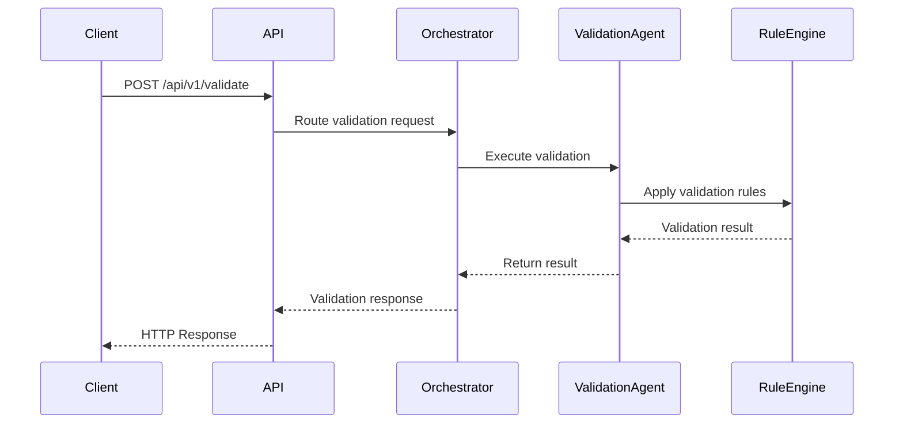

#### Asynchronous Validation Pattern
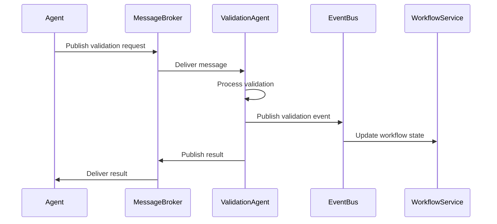

## API Integration Architecture

### Validation API Endpoints

```python
# Validation Router Structure
/api/v1/validation/
├── POST   /validate              # Direct validation
├── POST   /validate/async        # Async validation
├── GET    /rules                 # List validation rules
├── POST   /rules                 # Create validation rule
├── PUT    /rules/{rule_id}       # Update validation rule
├── DELETE /rules/{rule_id}       # Delete validation rule
├── GET    /metrics               # Get validation metrics
├── GET    /health                # Health check
```

### Request/Response Models

```python
# Validation Request Models
class ValidationRequest(BaseModel):
    task: str
    data: Dict[str, Any]
    options: Optional[ValidationOptions]
    correlation_id: Optional[str]

class ValidationOptions(BaseModel):
    strict_mode: bool = True
    return_warnings: bool = True
    cache_result: bool = False
    timeout_seconds: int = 30

# Validation Response Models
class ValidationResponse(BaseModel):
    valid: bool
    status: ValidationStatus
    errors: List[ValidationError]
    warnings: List[ValidationWarning]
    metadata: ValidationMetadata
    correlation_id: Optional[str]

class ValidationError(BaseModel):
    field: str
    message: str
    code: str
    severity: ErrorSeverity

class ValidationMetadata(BaseModel):
    rule_version: str
    execution_time_ms: float
    rules_applied: int
    cached: bool
```

## Deployment Architecture

### Container Deployment

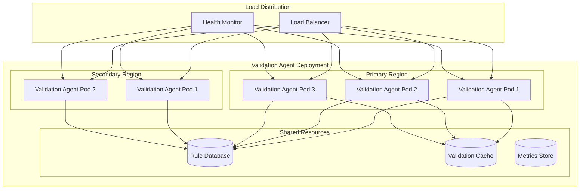

### Kubernetes Resources

```yaml
# Validation Agent Deployment Configuration
apiVersion: apps/v1
kind: Deployment
metadata:
  name: validation-agent
  namespace: agents
spec:
  replicas: 3
  selector:
    matchLabels:
      app: validation-agent
  template:
    metadata:
      labels:
        app: validation-agent
        agent-type: validation
    spec:
      containers:
      - name: validation-agent
        image: validation-agent:latest
        resources:
          requests:
            memory: "256Mi"
            cpu: "250m"
          limits:
            memory: "512Mi"
            cpu: "500m"
        env:
        - name: AGENT_TYPE
          value: "validation"
        - name: REGISTRY_URL
          value: "http://agent-registry:8080"
        - name: REDIS_URL
          valueFrom:
            secretKeyRef:
              name: redis-credentials
              key: url
        livenessProbe:
          httpGet:
            path: /health
            port: 8080
          initialDelaySeconds: 30
          periodSeconds: 10
        readinessProbe:
          httpGet:
            path: /ready
            port: 8080
          initialDelaySeconds: 5
          periodSeconds: 5

---
apiVersion: v1
kind: Service
metadata:
  name: validation-agent
  namespace: agents
spec:
  selector:
    app: validation-agent
  ports:
  - port: 8080
    targetPort: 8080
    name: http
  - port: 9090
    targetPort: 9090
    name: metrics

---
apiVersion: autoscaling/v2
kind: HorizontalPodAutoscaler
metadata:
  name: validation-agent-hpa
  namespace: agents
spec:
  scaleTargetRef:
    apiVersion: apps/v1
    kind: Deployment
    name: validation-agent
  minReplicas: 3
  maxReplicas: 10
  metrics:
  - type: Resource
    resource:
      name: cpu
      target:
        type: Utilization
        averageUtilization: 70
  - type: Resource
    resource:
      name: memory
      target:
        type: Utilization
        averageUtilization: 80
```

## Scalability Architecture

### Horizontal Scaling Strategy

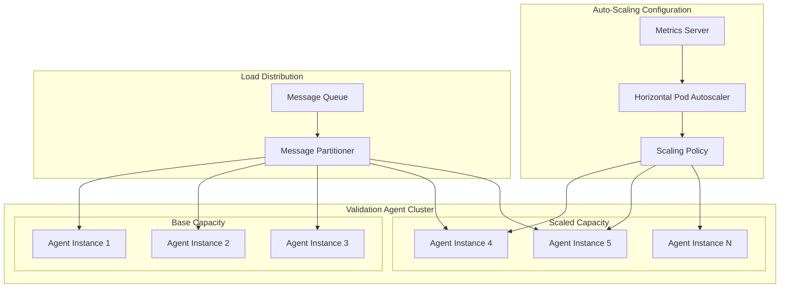

### Performance Optimization

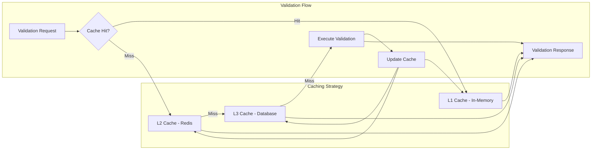

### Performance Configuration

```python
# Performance Optimization Settings
class PerformanceConfig:
    # Cache Configuration
    L1_CACHE_SIZE = 1000  # In-memory cache entries
    L1_CACHE_TTL = 300  # 5 minutes
    L2_CACHE_TTL = 3600  # 1 hour
    L3_CACHE_TTL = 86400  # 24 hours
    
    # Connection Pooling
    DB_POOL_SIZE = 20
    DB_POOL_TIMEOUT = 30
    REDIS_POOL_SIZE = 50
    
    # Batch Processing
    BATCH_SIZE = 100
    BATCH_TIMEOUT = 5  # seconds
    
    # Circuit Breaker
    FAILURE_THRESHOLD = 5
    RECOVERY_TIMEOUT = 60  # seconds
    HALF_OPEN_REQUESTS = 3
```

## Security Architecture

### Validation Security Layers

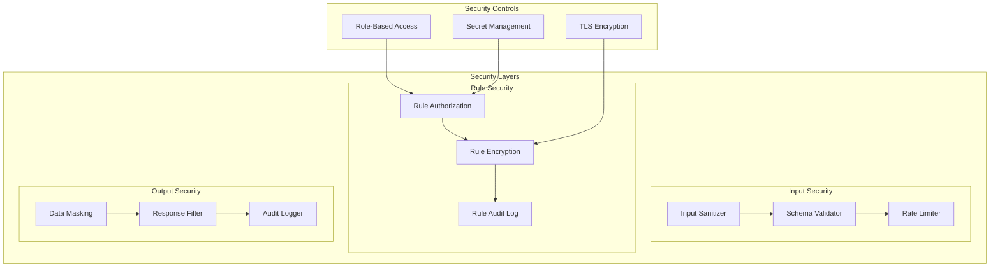

### Security Policies

```python
# Security Configuration
class ValidationSecurityConfig:
    # Input validation policies
    MAX_REQUEST_SIZE = 1_048_576  # 1MB
    MAX_VALIDATION_TIMEOUT = 60  # seconds
    RATE_LIMIT_PER_MINUTE = 1000
    
    # Rule access policies
    RULE_MODIFICATION_ROLES = ["admin", "rule_manager"]
    RULE_EXECUTION_ROLES = ["*"]  # All authenticated users
    
    # Data protection policies
    SENSITIVE_FIELD_PATTERNS = [
        r".*password.*",
        r".*secret.*",
        r".*token.*",
        r".*key.*"
    ]
    
    # Audit policies
    AUDIT_RETENTION_DAYS = 90
    AUDIT_ENCRYPTION_ENABLED = True
    
    # Network policies
    ALLOWED_ORIGINS = ["https://api.example.com"]
    REQUIRE_HTTPS = True
    MIN_TLS_VERSION = "1.2"
```

## Extension Architecture

### Plugin System for New Validation Types

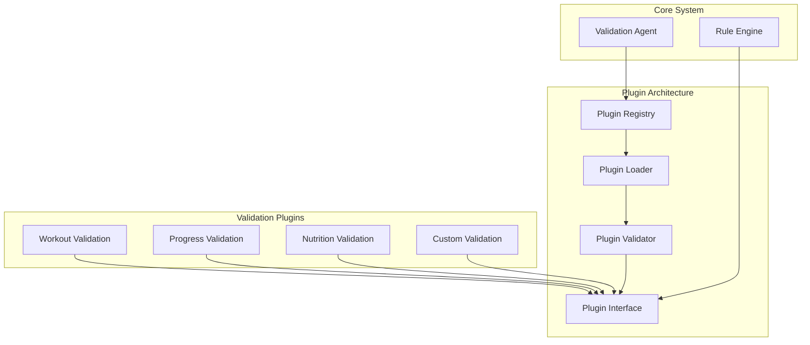

### Extension Points

```python
# Validation Plugin Interface
class ValidationPlugin(ABC):
    @property
    @abstractmethod
    def name(self) -> str:
        """Plugin name"""
        pass
    
    @property
    @abstractmethod
    def version(self) -> str:
        """Plugin version"""
        pass
    
    @property
    @abstractmethod
    def supported_tasks(self) -> List[str]:
        """List of supported validation tasks"""
        pass
    
    @abstractmethod
    def validate(self, data: Dict[str, Any]) -> ValidationResult:
        """Execute validation logic"""
        pass
    
    @abstractmethod
    def get_rules(self) -> List[ValidationRule]:
        """Get validation rules"""
        pass

# Rule Definition Interface
class ValidationRule(BaseModel):
    id: str
    name: str
    description: str
    rule_type: RuleType
    condition: Dict[str, Any]
    error_message: str
    severity: RuleSeverity
    enabled: bool = True

# Plugin Registration
class PluginRegistry:
    def register_plugin(self, plugin: ValidationPlugin) -> None:
        """Register a new validation plugin"""
        pass
    
    def unregister_plugin(self, plugin_name: str) -> None:
        """Unregister a validation plugin"""
        pass
    
    def get_plugin(self, task_type: str) -> Optional[ValidationPlugin]:
        """Get plugin for a specific task type"""
        pass
    
    def list_plugins(self) -> List[PluginInfo]:
        """List all registered plugins"""
        pass
```

## Integration with Existing Agents

### Agent Communication Flow

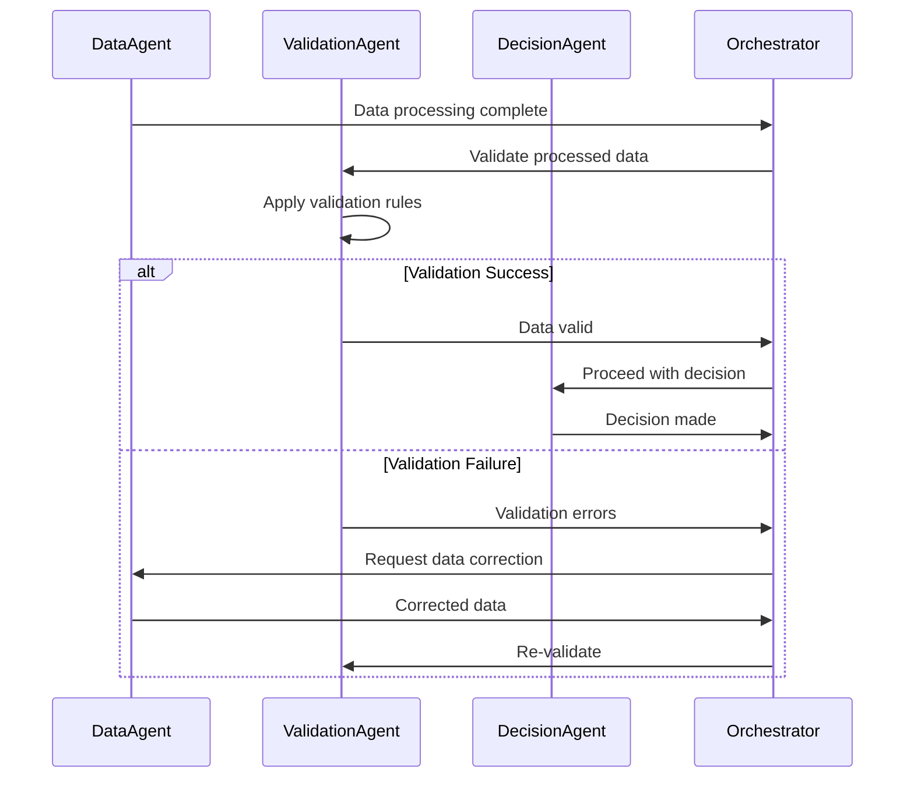

### Integration Patterns

#### 1. Pre-Processing Validation
```python
# Validate data before processing
async def pre_process_validation(data: Dict[str, Any]) -> ValidationResult:
    validation_request = ValidationRequest(
        task="validate_input_data",
        data=data,
        options=ValidationOptions(strict_mode=True)
    )
    return await validation_agent.validate(validation_request)
```

#### 2. Post-Processing Validation
```python
# Validate results after processing
async def post_process_validation(result: Dict[str, Any]) -> ValidationResult:
    validation_request = ValidationRequest(
        task="validate_output_data",
        data=result,
        options=ValidationOptions(return_warnings=True)
    )
    return await validation_agent.validate(validation_request)
```

#### 3. Workflow Integration
```python
# Integration in workflow definition
workflow_definition = {
    "steps": [
        {
            "id": "data_processing",
            "agent": "data_agent",
            "action": "process_data"
        },
        {
            "id": "validation",
            "agent": "validation_agent",
            "action": "validate",
            "depends_on": ["data_processing"]
        },
        {
            "id": "decision_making",
            "agent": "decision_agent",
            "action": "make_decision",
            "depends_on": ["validation"],
            "condition": "validation.result.valid == true"
        }
    ]
}
```

## Monitoring and Observability

### Validation Metrics Dashboard

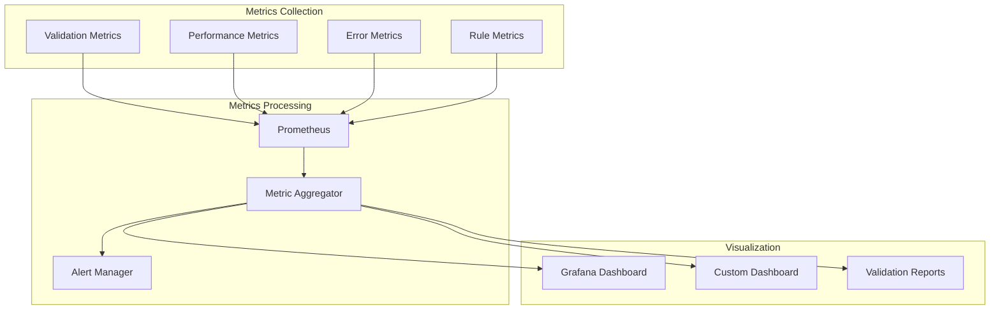

### Key Metrics

```python
# Validation Metrics
class ValidationMetrics:
    # Performance metrics
    validation_duration_histogram = Histogram(
        'validation_duration_seconds',
        'Time spent in validation',
        ['task_type', 'status']
    )
    
    # Throughput metrics
    validation_requests_total = Counter(
        'validation_requests_total',
        'Total validation requests',
        ['task_type', 'status']
    )
    
    # Error metrics
    validation_errors_total = Counter(
        'validation_errors_total',
        'Total validation errors',
        ['task_type', 'error_type']
    )
    
    # Rule metrics
    rule_executions_total = Counter(
        'rule_executions_total',
        'Total rule executions',
        ['rule_id', 'result']
    )
    
    # Cache metrics
    cache_hits_total = Counter(
        'validation_cache_hits_total',
        'Total cache hits',
        ['cache_level']
    )
    
    # Queue metrics
    queue_size_gauge = Gauge(
        'validation_queue_size',
        'Current validation queue size'
    )
```

### Monitoring Alerts

```yaml
# Prometheus Alert Rules
groups:
  - name: validation_agent_alerts
    rules:
      - alert: HighValidationErrorRate
        expr: rate(validation_errors_total[5m]) > 0.1
        for: 5m
        labels:
          severity: warning
        annotations:
          summary: High validation error rate detected
          description: "Validation error rate is {{ $value }} errors/sec"
      
      - alert: ValidationAgentDown
        expr: up{job="validation-agent"} == 0
        for: 1m
        labels:
          severity: critical
        annotations:
          summary: Validation agent is down
          description: "Validation agent instance {{ $labels.instance }} is down"
      
      - alert: HighValidationLatency
        expr: histogram_quantile(0.95, validation_duration_seconds) > 5
        for: 5m
        labels:
          severity: warning
        annotations:
          summary: High validation latency
          description: "95th percentile validation latency is {{ $value }} seconds"
```

## Error Handling Architecture

### Error Categories and Handling

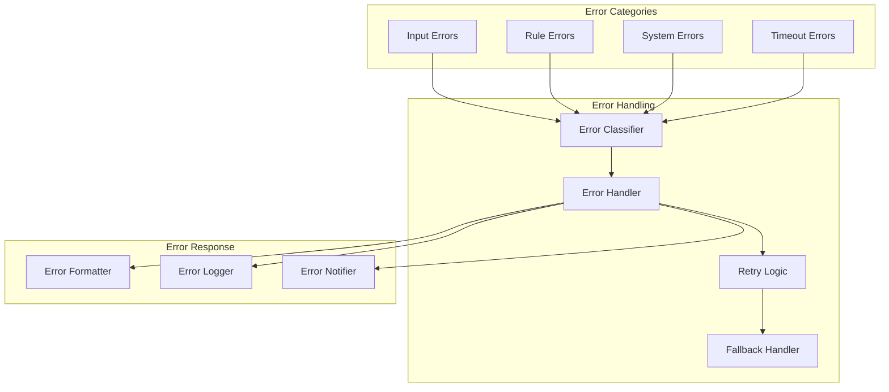

### Error Handling Implementation

```python
# Error Handler Configuration
class ErrorHandlerConfig:
    # Retry configuration
    MAX_RETRIES = 3
    RETRY_DELAY = 1  # seconds
    RETRY_BACKOFF = 2  # exponential backoff multiplier
    
    # Circuit breaker configuration
    FAILURE_THRESHOLD = 5
    RECOVERY_TIMEOUT = 60  # seconds
    
    # Error notification
    ERROR_NOTIFICATION_THRESHOLD = 10  # errors per minute
    NOTIFICATION_CHANNELS = ["slack", "email", "pagerduty"]

# Error Handler Implementation
class ValidationErrorHandler:
    async def handle_error(self, error: Exception, context: Dict[str, Any]) -> ErrorResponse:
        """Handle validation errors with appropriate strategy"""
        error_type = self.classify_error(error)
        
        if error_type == ErrorType.TRANSIENT:
            return await self.retry_with_backoff(context)
        elif error_type == ErrorType.INPUT_ERROR:
            return self.format_input_error(error, context)
        elif error_type == ErrorType.SYSTEM_ERROR:
            await self.notify_ops_team(error, context)
            return self.fallback_response(context)
        else:
            return self.default_error_response(error, context)
    
    def classify_error(self, error: Exception) -> ErrorType:
        """Classify error type for appropriate handling"""
        if isinstance(error, ValidationInputError):
            return ErrorType.INPUT_ERROR
        elif isinstance(error, TimeoutError):
            return ErrorType.TRANSIENT
        elif isinstance(error, DatabaseError):
            return ErrorType.SYSTEM_ERROR
        else:
            return ErrorType.UNKNOWN
```

## Summary

The Rule-Based Validation Agent integrates seamlessly into the FastAPI multi-agent architecture through:

1. **Modular Integration**: Clean service boundaries with well-defined interfaces
2. **Scalable Design**: Horizontal scaling with caching and load distribution
3. **Security-First**: Multiple security layers protecting validation rules and data
4. **Extensible Architecture**: Plugin system for easy addition of new validation types
5. **Observable System**: Comprehensive metrics and monitoring
6. **Resilient Operation**: Robust error handling and recovery mechanisms

The architecture supports the core requirements of modular validation rules, easy extension, proper error handling, and integration with existing FastAPI endpoints while maintaining the system's overall architectural principles.

### Key Integration Points

- **Agent Registry**: Dynamic registration and discovery
- **Message Broker**: Asynchronous communication with other agents
- **Event Bus**: Publishing validation events for workflow updates
- **API Gateway**: RESTful endpoints for direct validation
- **Monitoring Stack**: Prometheus metrics and Grafana dashboards
- **Security Layer**: RBAC, encryption, and audit logging

### Next Steps

1. Implement the validation agent following the architecture
2. Create validation plugins for specific use cases
3. Set up monitoring and alerting
4. Deploy to Kubernetes with auto-scaling
5. Integrate with existing workflows
6. Performance testing and optimization